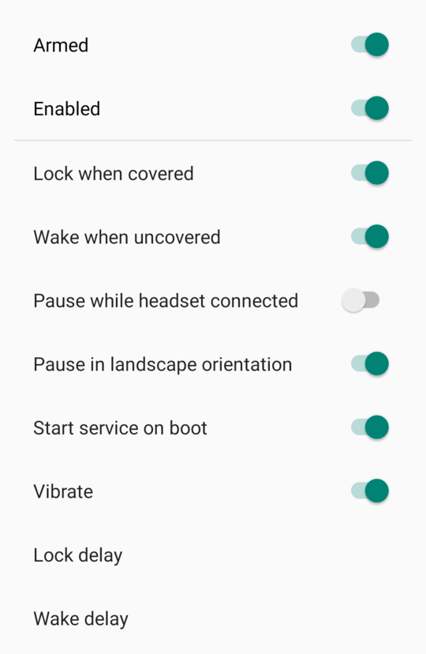

CoverLock
=========

Monitors proximity sensor and locks screen.

 
 

TODO:
-----
- pause button in notification / quick tile
- don't lock if whitelisted apps are in foreground or camera in use (optional, maybe unreliable)
- use slider to set delay and distance
- new icon

Limitations:
------------
- Face Unlock, Fingerprint and other "weak" authentication cannot be used after locking the device with DevicePolicyManager.lockNow()
  - "After this method is called, the device must be unlocked using strong authentication (PIN, pattern, or password)" [DevicePolicyManager#lockNow()](https://developer.android.com/reference/android/app/admin/DevicePolicyManager#lockNow())
  - DISABLE_KEYGUARD_FEATURES won't work, either: [Device admin deprecation](https://developers.google.com/android/work/device-admin-deprecation)
  - Trust Agent API not available
  - any other "lock **now**" method available?
  - see also: EMM DPC OCD
- "Pause in landscape orientation" doesn't work with apps that handle orientation change
  - camera and others
  - only in fullscreen activity?
  - register OnSystemUiVisibilityChange on notification view?

Settings:
---------

